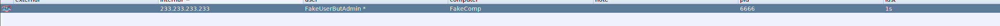
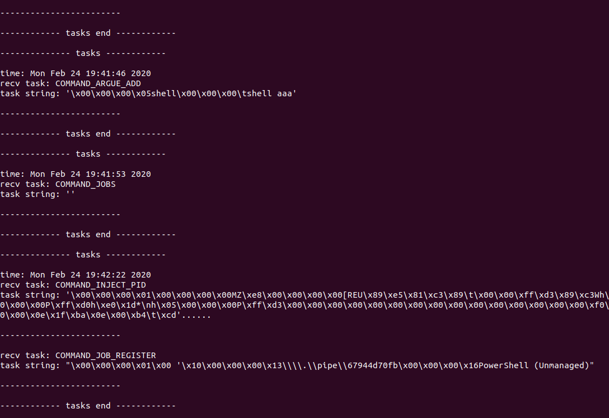
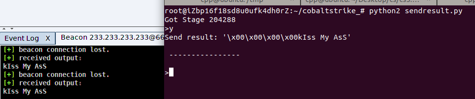

# cobaltstrike homework

这些东西都是根据cobalt strike3.14分析而来，现在应该有点过时了（毕竟4.0出了）

项目内容仅限学习用途，对，我就是为了学malware分析才搞的

## 项目说明

该repo包含了这几天和@caijiji 聚聚分析cobaltstrike的相关记录，项目文件说明如下：

```
│  C2Profile.md            
│  C2Protocol.md                           c2协议的格式
│  DNS.md
│  HTTP.md                                 分析cobaltstrike http c2代码
│  README.md
│  tasks_flow.md                           分析一个task从beacon console到task队列的过程
│  tree.md                                 cobaltstrike项目代码一些说明
│
├─img
│  │  fake_beacon.PNG
│  │  result_parser.PNG
│  │  script_parse_tasks.PNG
│  │  sendresult.PNG
│  │  zheng.jpg
│  │
│  └─HTTP
│          WebService_SubType.PNG
│
├─scripts                                 随便写的代码
│      define.py                          定义了c2的command和result类型
│      sendresult.py                      会发送给teamserver一个’kiss my ass‘ result
│      utils.py                           会连接external c2，然后会输出从teamserver得到的task类型
│
└─src                                     关于一些源码的分析
    ├─beacon
    │      BeaconC2.md
    │      BeaconData.md
    │      BeaconSetup.md
    │      CommandBuilder.md
    │
    ├─common
    │      BeaconEntry.md
    │
    ├─dns
    │      BaseSecurity.md
    │
    └─server
            Resources.md
```


## 脚本

* define.py: 定义了发现的c2 command和result类型
* utils.py: 连上cobaltstrike，自动导出public key，可以parse来自teamserver的task类型，稍微修改下就可以用来分析task组成结构，实现自定义beacon





* sendresult.py: 发送个简单的消息



这些脚本都是连接external c2的，非dns、http

## 其他

听说大家都在搞cobaltstrike？


## 其他其他

本来想把自定义命令和c2profile搞完，可是搞了三天发现好像没什么意思了，算了不搞了