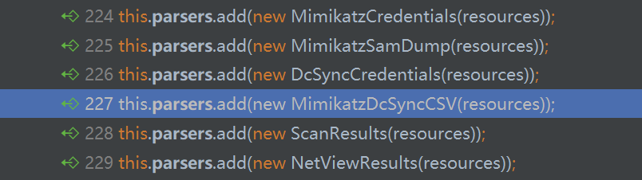

# overview

# 分析

## 加密

cobaltstrike使用的是非对称和对称加密结合的形式：`RSA + AES`

首先通过下面方法读取teamserver的key

`beacon.BeaconSetup#beacon_asymmetric`

```java
    public AsymmetricCrypto beacon_asymmetric() {
        try {
            final File file = new File(".cobaltstrike.beacon_keys");
            if (!file.exists()) {
                CommonUtils.writeObject(file, AsymmetricCrypto.generateKeys());
            }
            return new AsymmetricCrypto((KeyPair)CommonUtils.readObject(file, null));
        }
        catch (Exception ex) {
            MudgeSanity.logException("generate beacon asymmetric keys", ex, false);
            return null;
        }
    }
```

熟悉的`.cobaltstrike.beacon_keys`，存着整个teamserver唯一的私钥，值得一提的是，读取这个文件是直接`readObject`:

`common.CommonUtils#readObject`

```java
    public static Object readObject(final File file, final Object o) {
        try {
            if (file.exists()) {
                final ObjectInputStream objectInputStream = new ObjectInputStream(new FileInputStream(file));
                final Scalar scalar = (Scalar)objectInputStream.readObject();
// ...
```

至于有没有可能利用，不知道：），感兴趣可以分析一下。

实现了具体的非对称加密的类是`dns.AsymmetricCrypto#AsymmetricCrypto`

看这个包位置，我怎么感觉加密机制可能是dns信道出来之后才有的。

cobaltstrike使用的非对称加密模式为：`RSA/ECB/PKCS1Padding`

`dns.AsymmetricCrypto#AsymmetricCrypto`

```java
        this.privatekey = keyPair.getPrivate();
        this.publickey = keyPair.getPublic();
        this.cipher = Cipher.getInstance("RSA/ECB/PKCS1Padding");
```

RSA密钥长度为1024bits，我还以为是2048bits，不禁有点失望，估计可能是考虑包大小，毕竟用2048bits，那么一个c2的包最小也有256bytes

```java
    public static KeyPair generateKeys() {
        try {
            final KeyPairGenerator instance = KeyPairGenerator.getInstance("RSA");
            instance.initialize(1024);
            return instance.generateKeyPair();
```

具体的解密步骤：

`dns.AsymmetricCrypto#decrypt`

```java
public byte[] decrypt(final byte[] input) {
    byte[] doFinal = new byte[0];
    try {
        synchronized (this.cipher) {
            // 2 表示decryption
            this.cipher.init(2, this.privatekey);
            // 解密所有metadata
            doFinal = this.cipher.doFinal(input);
        }
        final DataInputStream dataInputStream = new DataInputStream(new ByteArrayInputStream(doFinal));
        if (dataInputStream.readInt() != 48879) {  // 48879 == 0xbeef，作为是否解密正确和判断是否是beacon传回数据的判断
            System.err.println("Magic number failed :( [RSA decrypt]");
            return new byte[0];
        }
        // 读入剩下数据的长度
        final int int1 = dataInputStream.readInt();
        // 大小限制 <= 117
        if (int1 > 117) {
            System.err.println("Length field check failed :( [RSA decrypt]");
            return new byte[0];
        }
        final byte[] b = new byte[int1];
        // 根据长度读入剩下的字节
        dataInputStream.readFully(b, 0, int1);
        return b;
    }
    catch (Exception ex) {
        MudgeSanity.logException("RSA decrypt", ex, false);
        return new byte[0];
    }
}
```

对称加密使用的是`dns.QuickSecurity`类，继承于`dns.BaseSecurity`，该类的字段定义如下：

```java
    // 即QuickSecurity的getCryptoScheme方法返回的值的定义，如果是trial版那么为1，表示不加密
    public static final short CRYPTO_LICENSED_PRODUCT = 0;
    public static final short CRYPTO_TRIAL_PRODUCT = 1;
    // iv 永远是abcdefghijklmnop
    protected IvParameterSpec ivspec;
    // "AES/CBC/NoPadding"
    protected Cipher in;
    // "AES/CBC/NoPadding"
    protected Cipher out;
    // mac instance，初始化为HMACSHA256
    protected Mac mac;
    // Map<String, BaseSecurity.Session>
    // @key: beacon id
    // @val: Session类，保存着session key,hash key和一个判断重放的counter
    protected static Map keymap;
```

再看这个类`registerKey`的过程：

`dns.BaseSecurity#registerKey`

```java
public void registerKey(final String bid, final byte[] input) {
	if (BaseSecurity.keymap.containsKey(bid)) {
        return;
    }
    try {
        final byte[] digest = MessageDigest.getInstance("SHA-256").digest(input);
        final byte[] copyOfRange = Arrays.copyOfRange(digest, 0, 16);
        final byte[] copyOfRange2 = Arrays.copyOfRange(digest, 16, 32);
        final Session session = new Session();
        session.key = new SecretKeySpec(copyOfRange, "AES");
        session.hash_key = new SecretKeySpec(copyOfRange2, "HmacSHA256");
        BaseSecurity.keymap.put(bid, session);
    }
    catch (Exception ex) {
        ex.printStackTrace();
    }
```

从metadata取得bid和用来生成session key的16字节初始密码后使用SHA256生成32字节的摘要，然后前16字节作为aes加密密钥，后16字节作为HMAC的hash密钥。

对称加密相关的分析参考`src/BaseSecurity.md`

## metadata process

`beacon.BeaconC2#process_beacon_metadata`

```java
public BeaconEntry process_beacon_metadata(final String externalAddr, final byte[] array, final String s2, final int n) {
// RSA1024解密metadata
final byte[] decrypt = this.getAsymmetricCrypto().decrypt(array);
if (decrypt == null || decrypt.length == 0) {
    CommonUtils.print_error("decrypt of metadata failed");
    return null;
}
final String bString = CommonUtils.bString(decrypt);
    // metadata开始的16字节是session key，之后用来生成正式的session key和hash key
final String session_key = bString.substring(0, 16);
    // ansi代码页，windows gui使用的代码页
final String name = WindowsCharsets.getName(CommonUtils.toShort(bString.substring(16, 18)));
    // oem代码页，windows console使用的代码页
final String name2 = WindowsCharsets.getName(CommonUtils.toShort(bString.substring(18, 20)));
    // 根据matadata new一个BeaconEntry对象，这个代表一个有beacon存在的目标
final BeaconEntry obj = new BeaconEntry(decrypt, name, externalAddr);
    // BeaconEntry会做metadata合法性校验，校验通过那么就继续
if (!obj.sane()) {
    CommonUtils.print_error("Session " + obj + " metadata validation failed. Dropping");
    return null;
}
    // 注册字符集
this.getCharsets().register(obj.getId(), name, name2);
    // s2表示parent bid的意思，代表这个beacon是某个beacon的子beacon，n代表link类型
if (s2 != null) {
    obj.link(s2, n);
}
    // 注册session key
this.getSymmetricCrypto().registerKey(obj.getId(), CommonUtils.toBytes(session_key));
	// 调用server.Beacons#checkin，如果是新的beacon回连，会做一系列初始化操作并写eventlog
if (this.getCheckinListener() != null) {
    this.getCheckinListener().checkin(obj);
}
else {
    CommonUtils.print_stat("Checkin listener was NULL (this is good!)");
}
return obj;
```

关于`common.BeaconEntry`，这个类定义了metadata的相关格式，具体分析参考`src/BeaconEntry.md`。

## dump tasks

通过调用`beacon.BeaconC2#dump(java.lang.String, int, int)`方法可以获取要发送给该beacon的任务，即command

```java
    public byte[] dump(final String bid, final int socksSize, final int threshold) {
        return this.dump(bid, socksSize, threshold, new LinkedHashSet());
    }
```

`beacon.BeaconC2#dump(java.lang.String, int, int, java.util.HashSet)`

```java
public byte[] dump(final String bid, final int size, final int threshold, final HashSet set) {
        // 用来判断是否重复dump beacon的task，因为下面会有递归dump子节点的task的操作
        if (!AssertUtils.TestUnique(bid, set)) {
            return new byte[0];
        }
        set.add(bid);

        // 取得该beacon的tasks，返回的byte数组大小小于threshold
        final byte[] tasks = this.data.dump(bid, threshold);
        final int length = tasks.length;
        // 该beacon如果运行了代理，还会从teamserver获取socks代理的数据
        final byte[] dump2 = this.socks.dump(bid, size - tasks.length);
        int total = length + dump2.length;
        try {
            final ByteArrayOutputStream byteArrayOutputStream = new ByteArrayOutputStream(size);
            if (tasks.length > 0) {
                byteArrayOutputStream.write(tasks, 0, tasks.length);
            }
            if (dump2.length > 0) {
                byteArrayOutputStream.write(dump2, 0, dump2.length);
            }
            
            // 这一段这么长实际上就是看这个beacon是不是连接了smb beacon，如果有连接的，那么就获取子beacon
            // 的task，在不超过大小限制的情况下也获取相关socks代理的数据发送过去
            final Iterator<Object> iterator = (Iterator<Object>)this.pipes.children(bid).iterator();
            while (iterator.hasNext()) {
                final String childbid = iterator.next() + "";
                if (total < size && this.getSymmetricCrypto().isReady(childbid)) {
                    final byte[] childDumpTask = this.dump(childbid, size - total, threshold - total, set);
                    if (childDumpTask.length > 0) {
                        final byte[] encrypt = this.getSymmetricCrypto().encrypt(childbid, childDumpTask);
                        final CommandBuilder commandBuilder = new CommandBuilder();
                        commandBuilder.setCommand(22);
                        commandBuilder.addInteger(Integer.parseInt(childbid));
                        commandBuilder.addString(encrypt);
                        final byte[] build = commandBuilder.build();
                        byteArrayOutputStream.write(build, 0, build.length);
                        total += build.length;
                    }
                    else {
                        if (this.socks.isActive(childbid) || !this.downloads.isActive(childbid)) {}
                        final CommandBuilder commandBuilder2 = new CommandBuilder();
                        commandBuilder2.setCommand(22);
                        commandBuilder2.addInteger(Integer.parseInt(childbid));
                        final byte[] build2 = commandBuilder2.build();
                        byteArrayOutputStream.write(build2, 0, build2.length);
                        total += build2.length;
                    }
                }
            }
            byteArrayOutputStream.flush();
            byteArrayOutputStream.close();
            final byte[] byteArray = byteArrayOutputStream.toByteArray();
            if (tasks.length > 0) {
                // 输出到beaconlog里
                this.getCheckinListener().output(BeaconOutput.Checkin(bid, "host called home, sent: " + byteArray.length + " bytes"));
            }
            return byteArray;
            // ...
```

dump出的tasks之后还会通过加密，最后发送给beacon。

## parse result

跟task一样，beacon也能同时返回多个result

`beacon.BeaconC2#process_beacon_data`

```java
public boolean process_beacon_data(final String bid, final byte[] result) {
    try {
        final DataInputStream dataInputStream = new DataInputStream(new ByteArrayInputStream(result));
        while (dataInputStream.available() > 0) {
            // 读取一个result长度
            final int len = dataInputStream.readInt();
            if (len > dataInputStream.available()) {
                CommonUtils.print_error("Beacon " + bid + " response length " + len + " exceeds " + dataInputStream.available() + " available bytes. [Received " + result.length + " bytes]");
                return false;
            }
            if (len <= 0) {
                CommonUtils.print_error("Beacon " + bid + " response length " + len + " is invalid. [Received " + result.length + " bytes]");
                return false;
            }
            final byte[] array2 = new byte[len];
            // 读出改result
            dataInputStream.read(array2, 0, len);
            this.process_beacon_callback(bid, array2);
        }
        dataInputStream.close();
        return true;

```

可以看到每个result都是用`process_beacon_callback`方法处理的

`beacon.BeaconC2#process_beacon_callback`

```java
    public void process_beacon_callback(final String s, final byte[] array) {
        this.process_beacon_callback_decrypted(s, this.getSymmetricCrypto().decrypt(s, array));
    }
```

实际就是个解密的过程，解密的分析参考`src/dns/BaseSecurity.md`

`beacon.BeaconC2#process_beacon_callback_decrypted`

```java
public void process_beacon_callback_decrypted(final String bid, final byte[] result) {
//...
try {
    final DataInputStream dataInputStream = new DataInputStream(new ByteArrayInputStream(result));
    // 读取result的类型，cobaltstrike管这个叫job= =
    job_type = dataInputStream.readInt();
    // 下面就是各个不同的Job类型的处理
    if (job_type == Job.CALLBACK_OUTPUT) {
        // 该类型就是直接输出到beacon console的窗口，输出前先根据metadata获取的ansi code page解码，这样就能适应各种语言的系统了
         final String process = this.getCharsets().process(bid, CommonUtils.readAll(dataInputStream));
         this.getCheckinListener().output(BeaconOutput.Output(bid, "received output:\n" + process));
        // 依次调用注册的parser去处理结果
         this.runParsers(process, bid, job_type);
    }
    // 下面是同样的各种分支
    // ...
    else {
        // 这里稍微有点不同
        // 检查这个beacon之前是否下发过task，如果没有，不允许处理下面这些类型的result
    	if (this.data.isNewSession(bid)) {
    	this.getCheckinListener().output(BeaconOutput.Error(bid, "Dropped responses from session. Didn't expect " + job_type + " prior to first task."));
    	CommonUtils.print_error("Dropped responses from session " + bid + " [type: " + job_type + "] (no interaction with this session yet)");
    	return;
        // 下发过task后才能处理的分支
```

上面比较重要的是这一步`this.runParsers(process, bid, job_type);`

cobaltstrike注册的parser有：



这些parser会处理相应的结果，比如`MimikatzCredentials`会提取hash然后存到credentials